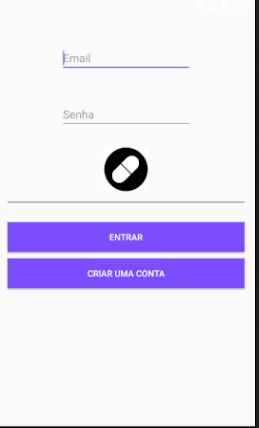
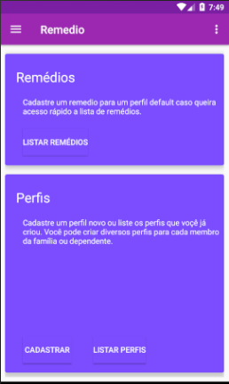
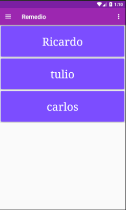
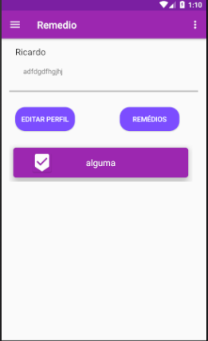

# Projeto para Controle de Remedios
Projeto da faculdade para controle de remedios, onde foram utilizadas as principais tecenologias do mercado de forma a contruir uma aplicação robusta e com interface simples, além de ofnrecer funcionalidades basicas.
O projeto original envovia o uso de armazenamento interno porém para proveito melhor foi realizado o uso do armazenamento em nuvem com firebird.

## Utilização
Cada usuário tem uma conta vinvulada ao aplicativo e cada conta tem deireito a criar diversos perfis para controle de dependentes. O projeto prever a criação de notificações para cada receita e a obtenção de um histórico com cada receita atendida.

## Suporte
+ Android OS 7.0 Nougat
+ Android Studio 3.0
+ Versão SDK 26
+ Versão SDK mínima 15

## Bibliotecas
+ com.google.firebase:firebase-auth:11.0.4
+ com.google.firebase:firebase-database:11.0.4

## Instalação
Você pode baixar ou clonar e transformar em apk.

Build → Build APK

## Screenshot
<Table>
<tr>
  <td>
  <td>
</tr>  
  <td>
  <td>
</Table>

## Futuro
O projeto ainda está incompleto, serão acionados notificações com requesição de ação do usuário para confirmaçao, histórico baseado nas notificações e login por facebook e google plus, além da recuperação de senha.

## Agradecimentos
Originalmente o projeto foi criado e posteriormente forkado por [Matteo Tognon](https://github.com/MatteoTognon321), atualmente ele voltou a esta página e está sobre os cuidados de Jefferson Abreu, então meus agradecimentos as implementações iniciais a Matteo Tognon e sua ajuda na documentação do projeto.

## Licença
O projeto está licenciado sobre [Apache LICENSE](https://github.com/Nabucodono5or/Remedio/blob/master/LICENSE)
